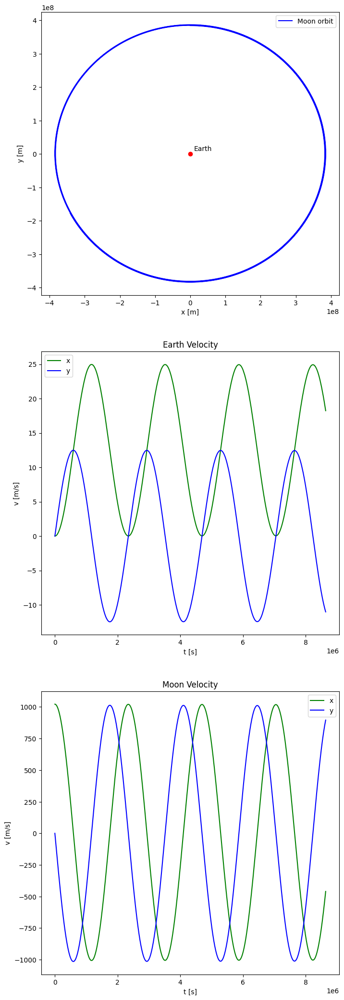

# `C++` expression templates projects
## Simple integration
This program presents a way of using expression templates in order to provide a very readable way of creating and passing functional objects to functions performing mathematical equations.
### Compilation and runing
In order to compile the program using `make` and `g++` and run it, you need to execute the following commands:
```bash
make func-expr
./func-expr
```
### Output interpretation
The program calculates and outputs the integral of `f(x) = 2x^2 - 3x + 3` function from `0` to `3`, using Trapezoidal Rule in steps of `0.001`. The analitical solution is `13.5`.
## Earth and Moon simulation
This simulation uses expression templates to efficiently calcultate the position of Earth and Moon in space (using velocity Verlet's method),
while maintaining the readability of code using expression templates for operations on vectors.
This is a very simple example of the use of expression templates. The simulation could be expanded to operating in more dimensions
and the approach could be applied to optimize operations on very large data structures.
### Compilation and runing
In order to compile the program using `make` and `g++` and run it, you need to execute the following commands:
```bash
make earth-moon
./earth-moon
```
### Output interpretation
The python script below visualizes the moon's orbit around Earth (it show's the moon's position relative to Earth, since in the simulation Earth isn't fixed to a point in space) and shows the changes of the velocity vector components.


```python
from pandas import read_csv
from matplotlib import pyplot

data = read_csv("outputs/earth_moon_positions.dat", sep=";")

fig, (ax_pos, ax_vel_earth, ax_vel_moon) = pyplot.subplots(3,1,figsize=(8,26))

ax_pos.plot(data["moon_position_x"]-data["earth_position_x"], data["moon_position_y"]-data["earth_position_y"], c="b", label="Moon orbit")
ax_pos.plot(0,0,"ro")
ax_pos.set_xlabel("x [m]")
ax_pos.set_ylabel("y [m]")
ax_pos.annotate("Earth", xy=(.1e8,.1e8))
ax_pos.legend()

ax_vel_earth.set_title("Earth Velocity")
ax_vel_earth.plot(data["time"], data["earth_velocity_x"], c="g", label="x")
ax_vel_earth.plot(data["time"], data["earth_velocity_y"], c="b", label="y")
ax_vel_earth.set_xlabel("t [s]")
ax_vel_earth.set_ylabel("v [m/s]")
ax_vel_earth.legend()

ax_vel_moon.set_title("Moon Velocity")
ax_vel_moon.plot(data["time"], data["moon_velocity_x"], c="g", label="x")
ax_vel_moon.plot(data["time"], data["moon_velocity_y"], c="b", label="y")
ax_vel_moon.set_xlabel("t [s]")
ax_vel_moon.set_ylabel("v [m/s]")
ax_vel_moon.legend()

pyplot.show()
```


    

    

